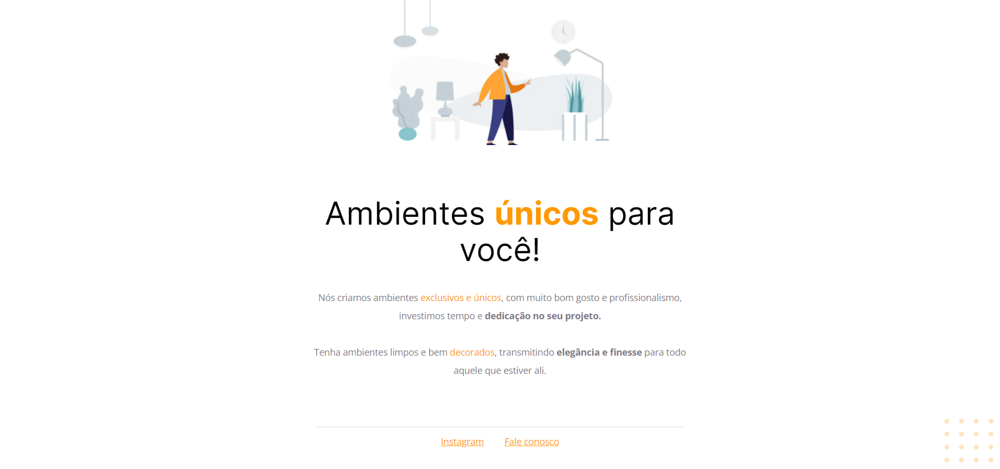
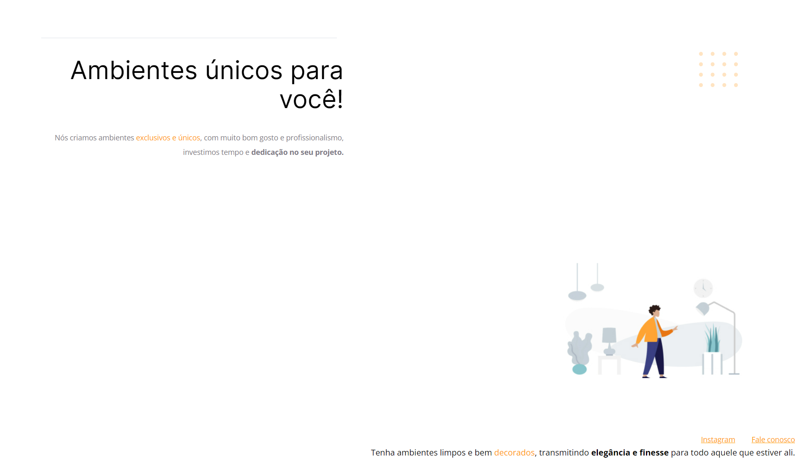

<h1 style="text-align: center;">Desafio 01 - Corrigindo bus</h1>

## Sobre o desafio
Desafia proposto no curso Explorer da <a href="https://www.rocketseat.com.br/">Rocketseat</a> referente aos ensinamentos do Stage 02. Onde recebemos o código quebrado para conserta-lo.

## Antes e depois

  

  
Antes

  
  

  

  
Depois

  
  

